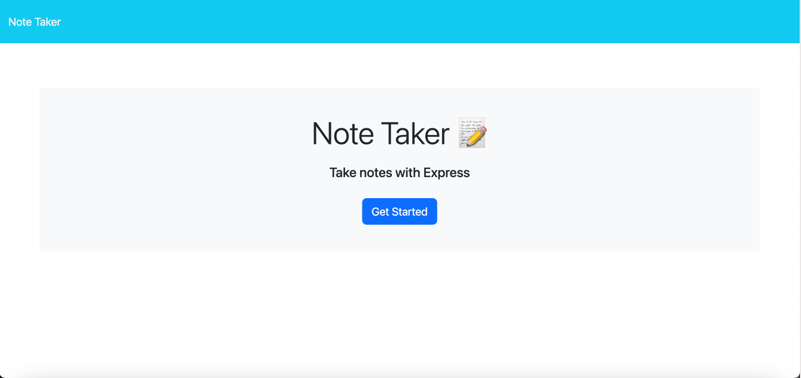
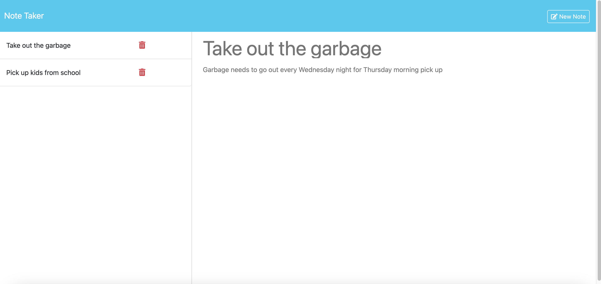
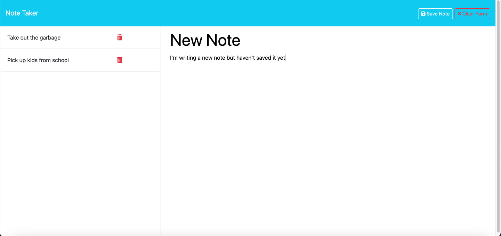

# Note Taker Application

  

  ## Description
  This is a an application built using an Express.js back end that allows you to create, view and delete notes. 

  
  ## Table of Contents
  - [URL of Deployed Application](#url-of-deployed-application)
  - [Screenshots of Deployed Application](#screenshots-of-deployed-application)
  - [Installation](#installation)
  - [Usage](#usage)
  - [Contributing](#contributing)
  - [Tests](#tests)
  - [Technologies](#technologies)
  - [License](#license)
  - [Questions](#questions)

  ## URL of Deployed Application

  [Note Taker Application on Render](https://note-taker-application-h12b.onrender.com)

  ## Screenshots of Deployed Application

  

  

    

  ## Installation
  There is no installation necessary, simply follow the link provided in the "URL of Deployed Application section and add some notes!

  ## Usage
  This application can be used to keep track of notes or tasks that a user wants to stay on top of. Here are some of the user stories, i.e. 
  acceptance criteria that helped me build this application:

  GIVEN a note-taking application
  WHEN I open the Note Taker
  THEN I am presented with a landing page with a link to a notes page
  WHEN I click on the link to the notes page
  THEN I am presented with a page with existing notes listed in the left-hand column, plus empty fields to enter a new note title and the       note’s text in the right-hand column
  WHEN I enter a new note title and the note’s text
  THEN a "Save Note" button and a "Clear Form" button appear in the navigation at the top of the page
  WHEN I click on the Save button
  THEN the new note I have entered is saved and appears in the left-hand column with the other existing notes and the buttons in the            navigation disappear
  WHEN I click on an existing note in the list in the left-hand column
  THEN that note appears in the right-hand column and a "New Note" button appears in the navigation
  WHEN I click on the "New Note" button in the navigation at the top of the page
  THEN I am presented with empty fields to enter a new note title and the note’s text in the right-hand column and the button disappears

  ## Contributing
  N/A

  ## Tests
  N/A

  ## Technologies
  
  Node.js, Express.js, JSON, Bootstrap, Javascript

   ## License
  MIT

  ## Questions

  For any additional questions or feedback, please contact me with the following information:
  Github: (https://github.com/tjmcd2010)
  Email: (mailto:tjmcd2010@gmail.com)  

